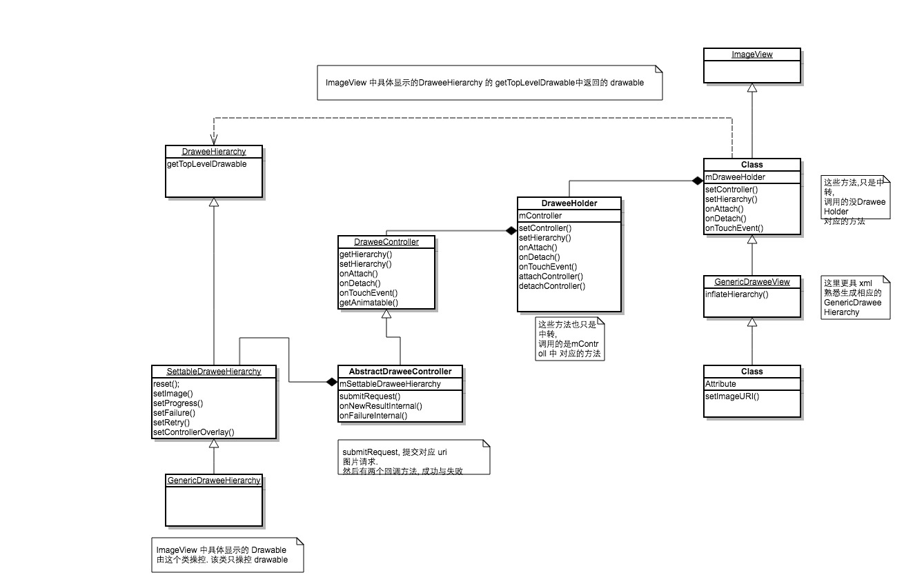

ok 这一节我们主要来讲一讲 Fresco 最重要的控制器 DraweeController

我们找到 DraweeController, 发现他是一个接口:
```
public interface DraweeController {
  DraweeHierarchy getHierarchy();
  void setHierarchy(@Nullable DraweeHierarchy hierarchy);
  void onAttach();
  void onDetach();
  boolean onTouchEvent(MotionEvent event);
  Animatable getAnimatable();
  void setContentDescription(String contentDescription);
  String getContentDescription();
}
```

然后找他的实现类, 发现有一个 abstract 的实现类  `abstract class AbstractDraweeController`

然后继续去找实现类, 发现有两个:`VolleyDraweeController` , `PipelineDraweeController`

那么我们之前讲到的那个 controller 到底是哪个呢?
这个对回到最开始看, controller 是怎么构建出来的

我们回到 SimpleDraweeView 类的setImageURI 方法, controller 是从这里构建出来的:
```
public void setImageURI(Uri uri, @Nullable Object callerContext) {
  // 一般情况下 都是 PipelineDraweeControllerBuilderSupplier
  DraweeController controller = mSimpleDraweeControllerBuilder
      .setCallerContext(callerContext)
      .setUri(uri)
      .setOldController(getController())
      .build();
  // 设置控制器,  在设置 uri 的时候才设置控制器
  // 到最后 都是设置一个 控制器
  setController(controller);
}
```
是由 mSimpleDraweeControllerBuilder 构建出来的

然后 mSimpleDraweeControllerBuilder 是在 init 方法中完成的
```
private void init(Context context, @Nullable AttributeSet attrs) {
  // 省略代码
  mSimpleDraweeControllerBuilder = sDraweeControllerBuilderSupplier.get();
  // 省略代码
}
```
是通过调用 sDraweeControllerBuilderSupplier.get 方法来获取的.

我继续看, sDraweeControllerBuilderSupplier是SimpleDraweeView 的一个静态变量
然后 mSimpleDraweeControllerBuilder 的初始化是在 SimpleDraweeView.initialize()方法,这是一个静态方法
然后继续看这个方法的调用者, 发现是 Fresco 类.
```
private static void initializeDrawee(Context context) {
  sDraweeControllerBuilderSupplier = new PipelineDraweeControllerBuilderSupplier(context);
  // 初始化 SimpleDraweeView
  SimpleDraweeView.initialize(sDraweeControllerBuilderSupplier);
}
```

还有在VolleyDraweeAdapter 类中也有调用 SimpleDraweeView.initialize方法, 但是在我们的正常使用过程中, 基本没有使用到这个类.
而Fresco类, 在我们初始化 fresco 的时候就用到了
所以这里我们基本能够确定说是 我们之前分析的 controller 是有PipelineDraweeControllerBuilderSupplier 构建的
然后 controller 自然就是PipelineDraweeController类型.
当然这样说有点武断. 有兴趣的课自己跟着一步步看, 这里不做过多的详细描述.
还有关于具体的构建出 PipelineDraweeController 对象的过程 基本跟着方法走就问题不大了, 这里也不多做描述

现在最好不要太过多的深入某个类或者方法的细节, 不然很难看清全貌.

我们现在确定了说controller 是PipelineDraweeController类型.
我们开看看他的构造方法, 参数有点多:
```
public PipelineDraweeController(
      Resources resources,
      DeferredReleaser deferredReleaser,// 释放资源的辅助对象
      AnimatedDrawableFactory animatedDrawableFactory,// 动画 drawable 工厂
      Executor uiThreadExecutor,// 线程池
      MemoryCache<CacheKey, CloseableImage> memoryCache,// 缓存对象
      Supplier<DataSource<CloseableReference<CloseableImage>>> dataSourceSupplier,// 数据提供者
      String id,// 对应的 id
      CacheKey cacheKey,// 对应的缓存 key
      Object callerContext// 调用者的上下文, 一本为空
      ) {
      super(deferredReleaser, uiThreadExecutor, id, callerContext);
    mResources = resources;
    mAnimatedDrawableFactory = animatedDrawableFactory;
    mMemoryCache = memoryCache;
    mCacheKey = cacheKey;
    init(dataSourceSupplier);
  }
```
这里关于构造参数中的一些对象可能不太了解具体是干嘛的, 但是这不妨碍我们分享的主线. 上面我对一些参数都做了一些基本的注释.
暂时先道个大概是这个对象是干嘛的就好

回到我们之前关于 DraweeHolder 的分析, 发现 onAttach 和 onDetach 的时候都分别调用了对应的方法
我们先去 onAttach 方法看看, 发现该方法的实现在 AbstractDraweeController 类中:
```
@Override
  public void onAttach() {
    mEventTracker.recordEvent(Event.ON_ATTACH_CONTROLLER);
    Preconditions.checkNotNull(mSettableDraweeHierarchy);
    mDeferredReleaser.cancelDeferredRelease(this);
    mIsAttached = true;
    if (!mIsRequestSubmitted) {
      // 没有提交请求的话, 则去提交请求
      submitRequest();
    }
  }

  // 提交请求  T 是 CloseableReference<CloseableImage>
  protected void submitRequest() {
    final T closeableImage = getCachedImage();
    if (closeableImage != null) {
      mDataSource = null;
      mIsRequestSubmitted = true;
      mHasFetchFailed = false;
      // 命中缓存
      mEventTracker.recordEvent(Event.ON_SUBMIT_CACHE_HIT);
      getControllerListener().onSubmit(mId, mCallerContext);
      // 去显示图片
      onNewResultInternal(mId, mDataSource, closeableImage, 1.0f, true, true);
      return;
    }
    mEventTracker.recordEvent(Event.ON_DATASOURCE_SUBMIT);
    // 回调开始提交
    getControllerListener().onSubmit(mId, mCallerContext);
    // 设置当前进度为0
    mSettableDraweeHierarchy.setProgress(0, true);
    mIsRequestSubmitted = true;
    mHasFetchFailed = false;

    // 这里获取请求数据
    mDataSource = getDataSource();

    final String id = mId;
    final boolean wasImmediate = mDataSource.hasResult();

    // 构建结果回调 对象
    final DataSubscriber<T> dataSubscriber =
        new BaseDataSubscriber<T>() {
          @Override
          public void onNewResultImpl(DataSource<T> dataSource) {
            // 成功返回图片数据
            // isFinished must be obtained before image, otherwise we might set intermediate result
            // as final image.
            boolean isFinished = dataSource.isFinished();
            float progress = dataSource.getProgress();
            T image = dataSource.getResult();
            if (image != null) {
              onNewResultInternal(id, dataSource, image, progress, isFinished, wasImmediate);
            } else if (isFinished) {
              onFailureInternal(id, dataSource, new NullPointerException(), /* isFinished */ true);
            }
          }
          @Override
          public void onFailureImpl(DataSource<T> dataSource) {
            onFailureInternal(id, dataSource, dataSource.getFailureCause(), /* isFinished */ true);
          }
          @Override
          public void onProgressUpdate(DataSource<T> dataSource) {
            boolean isFinished = dataSource.isFinished();
            float progress = dataSource.getProgress();
            onProgressUpdateInternal(id, dataSource, progress, isFinished);
          }
        };
    // 订阅结果  是一个结果链条, 最后会吧结果传递到 dataSubscriber
    mDataSource.subscribe(dataSubscriber, mUiThreadImmediateExecutor);
  }
```
ok 通过上面两个方法, 可以知道 在 onAttach 方法的时候会去提交显示图片请求, 会首先去缓存中判断是否有图片, 有的话调用 onNewResultInternal 去显示图片,
没有的话, 需要去查看本地缓存, 或者请求网络. 这两步封装在一起.

但是看上面的方法, 会非常的迷惑,mDataSource.subscribe 一下就能获取到对应的记过, 这里到底是怎么处理的呢?
这个我们这一届暂时不予讨论.
然后就是关于内存缓存那块的处理, 这里没有详细的描述, 这个也放到后面,今天这里主要大致的描述 controller

上面我们看到说, 当获取图片成功时会调用onNewResultInternal 方法, ok 我接着去看这个方法
```
// 获取到了图片 数据
private void onNewResultInternal(
    String id,
    DataSource<T> dataSource,
    @Nullable T image,
    float progress,
    boolean isFinished,
    boolean wasImmediate) {
  // ignore late callbacks (data source that returned the new result is not the one we expected)
  if (!isExpectedDataSource(id, dataSource)) {
    // 忽略过期了的回调
    logMessageAndImage("ignore_old_datasource @ onNewResult", image);
    releaseImage(image);
    dataSource.close();
    return;
  }
  mEventTracker.recordEvent(isFinished ? Event.ON_DATASOURCE_RESULT : Event.ON_DATASOURCE_RESULT_INT);
  // create drawable
  Drawable drawable;
  try {
    // 更具 image 对象创建 drawable
    drawable = createDrawable(image);
  } catch (Exception exception) {
    logMessageAndImage("drawable_failed @ onNewResult", image);
    releaseImage(image);
    onFailureInternal(id, dataSource, exception, isFinished);
    return;
  }
  T previousImage = mFetchedImage;
  Drawable previousDrawable = mDrawable;
  mFetchedImage = image;
  mDrawable = drawable;
  try {
    // set the new image
    if (isFinished) {
      logMessageAndImage("set_final_result @ onNewResult", image);
      mDataSource = null;
      // 调用 Hierarchy setImage 方法 显示图片
      mSettableDraweeHierarchy.setImage(drawable, 1f, wasImmediate);
      // 回调显示最终的图片
      getControllerListener().onFinalImageSet(id, getImageInfo(image), getAnimatable());
      // IMPORTANT: do not execute any instance-specific code after this point
    } else {
      logMessageAndImage("set_intermediate_result @ onNewResult", image);
      mSettableDraweeHierarchy.setImage(drawable, progress, wasImmediate);
      // 回调 显示渐进图片
      getControllerListener().onIntermediateImageSet(id, getImageInfo(image));
      // IMPORTANT: do not execute any instance-specific code after this point
    }
  } finally {
    if (previousDrawable != null && previousDrawable != drawable) {
      // 释放之前的图片
      releaseDrawable(previousDrawable);
    }
    if (previousImage != null && previousImage != image) {
      logMessageAndImage("release_previous_result @ onNewResult", previousImage);
      releaseImage(previousImage);
    }
  }
}
```
从上面的方法可以看到, 通过请求或者缓存获取到 imgae数据, 然后经过一系列的处理,
最后调用了Hierarchy的setImage 方法, 将图片显示在View 上,


看到现在这里在结合我之前给的一个UML 图,是否会有一个相对清晰的印象.
更加的了解了 SimpleDraweeView 与 controller 与 holder 与 Hierarchy 之间的关系.
draweeView 持有holder 对象
然后 holder 对象持有 controller 与 Hierarchy 对象
controller 持有 Hierarchy 对象

draweeView 控制 holder
holder 控制 controller
controller 控制 Hierarchy


现在fresco的整体架构 基本搞清楚了 , 那么接下来就可以去探究一些内部实现的细节.


